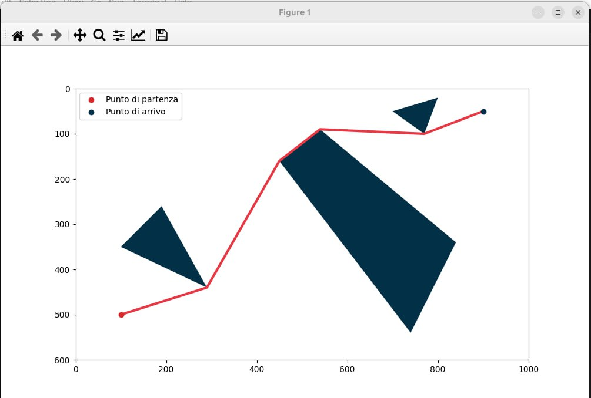

# Visibility Graph

Il Visibility Graph è un metodo ampiamente utilizzato per la pianificazione di percorsi in ambienti con
ostacoli. Esso sfrutta la costruzione di un grafo, in cui i nodi rappresentano i punti critici dell'ambiente
e gli archi definiscono le linee di visibilità tra di essi. L'algoritmo determina quindi il percorso più
breve, utilizzando l’algoritmo di Dijkstra, sulla base di questo grafo, permettendo al robot di navigare
attraverso ostacoli in modo efficiente, evitando collisioni e minimizzando il tempo di percorrenza.
Inoltre, è stato sviluppato uno script che permette al robot 2d con due ruote di seguire con precisione
la traiettoria calcolata dal Visibility Graph. Per ottenere questo risultato, sono stati utilizzati controller
PID (Proporzionale-Integrale-Derivativo) per le velocità delle ruote destra e sinistra e il controllo
polare per posizione e l'orientamento del robot rispetto ad un punto di riferimento e la sua direzione
di spostamento. Questa combinazione di tecniche di controllo ha consentito di regolare
accuratamente la velocità del robot durante la navigazione, garantendo la stabilità e il mantenimento
del percorso desiderato.

